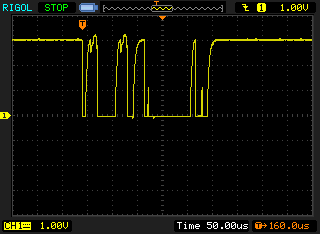
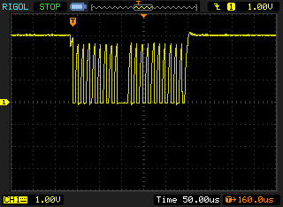

# Interfacing with an I2C Sensor 🔬

This guide provides a detailed walkthrough on how to include, initialize, and use an I2C sensor with your STM32 project. We'll use the `pmwcs3` soil moisture sensor as an example, which is connected to the I2C1 peripheral.

## 🌟 Introduction

I2C (Inter-Integrated Circuit) is a popular serial communication protocol used for connecting microcontrollers to peripheral devices like sensors, EEPROMs, and real-time clocks. It uses two wires: Serial Data (SDA) and Serial Clock (SCL).

In this project, we assume you are working with an I2C sensor (e.g., `pmwcs3` soil moisture sensor) that needs to be interfaced with the STM32 microcontroller.

## 🛠️ Hardware Setup

1.  **Connect your I2C sensor:**
    *   Sensor's SDA pin to STM32's I2C1 SDA pin (typically PB7).
    *   Sensor's SCL pin to STM32's I2C1 SCL pin (typically PB6).
    *   Connect the sensor's VCC and GND to appropriate power sources.
    *   Ensure pull-up resistors are present on the SDA and SCL lines if not already on the sensor module or STM32 board. The `HAL_I2C_MspInit` function in this project configures internal pull-ups.

## 💻 Software Setup & Initialization

The STM32 HAL (Hardware Abstraction Layer) simplifies peripheral configuration. Initialization involves setting up GPIOs, enabling clocks, and configuring the I2C peripheral itself.

### 1. Include Necessary Headers

Ensure you have the main HAL header and any sensor-specific headers included in your source files (e.g., `main.c` or your sensor driver file).

```c
// filepath: Core/Src/main.c
// ...existing code...
#include "main.h" // Includes HAL drivers and peripheral handles like hi2c1
/* USER CODE BEGIN Includes */
#include "pmwcs3.h" // Assuming you have a header for your sensor
/* USER CODE END Includes */
// ...existing code...
```

### 2. MSP (MCU Support Package) Initialization

The `HAL_I2C_MspInit` function is crucial for low-level hardware setup. It's typically called by `HAL_I2C_Init`. This function is defined in [Core/Src/stm32l0xx_hal_msp.c](Core/Src/stm32l0xx_hal_msp.c).

*   **Enable GPIO Clocks**: The clock for the GPIO port used by I2C (e.g., GPIOB) must be enabled.
*   **Configure GPIO Pins**: The SDA and SCL pins are configured for alternate function, open-drain mode, with pull-ups enabled and high speed.
*   **Enable I2C Peripheral Clock**: The clock for the I2C peripheral itself (e.g., I2C1) must be enabled.
*   **(Optional) NVIC Configuration**: If using I2C interrupts or DMA, the NVIC (Nested Vectored Interrupt Controller) would be configured here.

Here's how it's done for I2C1 in this project:
```c
// filepath: Core/Src/stm32l0xx_hal_msp.c
// ...existing code...
void HAL_I2C_MspInit(I2C_HandleTypeDef* hi2c)
{
  GPIO_InitTypeDef GPIO_InitStruct = {0};
  if(hi2c->Instance==I2C1)
  {
    /* USER CODE BEGIN I2C1_MspInit 0 */

    /* USER CODE END I2C1_MspInit 0 */

    __HAL_RCC_GPIOB_CLK_ENABLE(); // 🌍 Enable GPIOB clock
    /**I2C1 GPIO Configuration
    PB6     ------> I2C1_SCL
    PB7     ------> I2C1_SDA
    */
    GPIO_InitStruct.Pin = GPIO_PIN_6|GPIO_PIN_7;
    GPIO_InitStruct.Mode = GPIO_MODE_AF_OD;       // Alternate Function Open Drain
    GPIO_InitStruct.Pull = GPIO_PULLUP;          // Enable Pull-up resistors
    GPIO_InitStruct.Speed = GPIO_SPEED_FREQ_VERY_HIGH; // Set GPIO speed
    GPIO_InitStruct.Alternate = GPIO_AF1_I2C1;     // Set alternate function for I2C1
    HAL_GPIO_Init(GPIOB, &GPIO_InitStruct);      // Initialize GPIOB pins

    /* Peripheral clock enable */
    __HAL_RCC_I2C1_CLK_ENABLE(); // 🌍 Enable I2C1 peripheral clock
    /* USER CODE BEGIN I2C1_MspInit 1 */

    /* USER CODE END I2C1_MspInit 1 */
  }
}
// ...existing code...
```

### 3. I2C Peripheral Initialization

The `MX_I2C1_Init` function (or a similar function, often found in `main.c`) configures the I2C peripheral parameters like timing (for speed), addressing mode, etc. This function calls `HAL_I2C_Init`, which in turn calls `HAL_I2C_MspInit`.

```c
// filepath: Core/Src/main.c
// ...existing code...
I2C_HandleTypeDef hi2c1; // Declare the I2C handle

static void MX_I2C1_Init(void)
{
  /* USER CODE BEGIN I2C1_Init 0 */
  /* USER CODE END I2C1_Init 0 */
  /* USER CODE BEGIN I2C1_Init 1 */
  /* USER CODE END I2C1_Init 1 */
  hi2c1.Instance = I2C1;
  hi2c1.Init.Timing = 0x00707CBB; // Example timing for 100kHz, adjust as needed
  hi2c1.Init.OwnAddress1 = 0;
  hi2c1.Init.AddressingMode = I2C_ADDRESSINGMODE_7BIT;
  hi2c1.Init.DualAddressMode = I2C_DUALADDRESS_DISABLE;
  hi2c1.Init.OwnAddress2 = 0;
  hi2c1.Init.OwnAddress2Masks = I2C_OA2MSK_DISABLE;
  hi2c1.Init.GeneralCallMode = I2C_GENERALCALL_DISABLE;
  hi2c1.Init.NoStretchMode = I2C_NOSTRETCH_DISABLE;
  if (HAL_I2C_Init(&hi2c1) != HAL_OK) // 🚀 Initialize I2C1
  {
    Error_Handler();
  }
  /** Configure Analogue filter
  */
  if (HAL_I2CEx_ConfigAnalogFilter(&hi2c1, I2C_ANALOGFILTER_ENABLE) != HAL_OK)
  {
    Error_Handler();
  }
  /** Configure Digital filter
  */
  if (HAL_I2CEx_ConfigDigitalFilter(&hi2c1, 0) != HAL_OK)
  {
    Error_Handler();
  }
  /* USER CODE BEGIN I2C1_Init 2 */
  // Custom timing for 100kHz as seen in your main.c
  hi2c1.Init.Timing = 0x30420F13;
  if (HAL_I2C_DeInit(&hi2c1) != HAL_OK) { Error_Handler(); } // DeInit before re-Init with new timing
  if (HAL_I2C_Init(&hi2c1) != HAL_OK) { Error_Handler(); }
  /* USER CODE END I2C1_Init 2 */
}
// ...existing code...
```
Make sure `MX_I2C1_Init()` is called in your `main()` function after `HAL_Init()` and `SystemClock_Config()`.

### 4. Initializing the Specific Sensor

Once the I2C peripheral is ready, you can initialize your specific sensor. This usually involves creating a sensor handle and calling an initialization function provided by the sensor's driver/library.

Example using the `pmwcs3` sensor from your `main.c`:
```c
// filepath: Core/Src/main.c
// ...existing code...
/* USER CODE BEGIN Includes */
#include "pmwcs3.h" // Ensure this is included
/* USER CODE END Includes */

/* USER CODE BEGIN PV */
PMWCS3_HandleTypeDef soil; // Sensor handle
/* USER CODE END PV */

// ... in your task or main loop setup ...
void StartDefaultTask(void const * argument)
{
  /* USER CODE BEGIN 5 */
  /* Infinite loop */
  // MX_I2C1_Init(); // Should be called before this task starts, in main()

  // Initialize the pmwcs3 sensor
  // The address 0x63 is specific to this sensor. Check your sensor's datasheet!
  pmwcs3_init(&soil, &hi2c1, 0x63); // 🌱 Initialize sensor
  // ...existing code...
}
```

## 💡 Using the Sensor

After initialization, you can interact with the sensor (e.g., read data, write configuration). The functions for these operations will be specific to your sensor's library.

Example for `pmwcs3`:
```c
// filepath: Core/Src/main.c
// ... in your task or main loop ...
void StartDefaultTask(void const * argument)
{
  /* USER CODE BEGIN 5 */
  pmwcs3_init(&soil, &hi2c1, 0x63);
  for (;;)
  {
    int ret = pmwcs3_new_reading(&soil); /* 💧 Trigger a new reading */
    if (ret != PMWCS3_OK) {
      // Handle error, e.g., print to UART or log
      Error_Handler();
    } else {
      // Reading successful, access data from the 'soil' handle
      // e.g., float temperature = soil.temperature;
      //      float moisture = soil.moisture;
      //      printf("Temp: %.2f C, Moisture: %.2f %%\r\n", temperature, moisture);
    }
    osDelay(1000); // Wait for a second before the next reading
  }
  /* USER CODE END 5 */
}
```

## 📝 Example Code Snippet (Conceptual)

Here's a simplified flow of how you might integrate an I2C sensor:

```c
#include "main.h"
#include "your_sensor.h" // Replace with your sensor's header

I2C_HandleTypeDef hi2c1;      // Defined in main.c
YOUR_SENSOR_HandleTypeDef mySensor; // Your sensor's handle

// main() function
int main(void) {
  HAL_Init();
  SystemClock_Config();

  MX_GPIO_Init();    // Initializes all GPIOs
  MX_I2C1_Init();    // Initializes I2C1 peripheral (calls HAL_I2C_MspInit internally)

  // Initialize your sensor
  if (YOUR_SENSOR_Init(&mySensor, &hi2c1, SENSOR_I2C_ADDRESS) != SENSOR_OK) {
    Error_Handler(); // Sensor initialization failed
  }

  while (1) {
    // Read data from sensor
    float sensorValue = YOUR_SENSOR_ReadValue(&mySensor);

    // Process sensorValue
    // ...

    HAL_Delay(100); // Delay
  }
}
```

## 🤔 Troubleshooting Tips

*   **Check Connections**: Double-check SDA, SCL, VCC, and GND connections.
*   **Pull-up Resistors**: Ensure appropriate pull-up resistors are on SDA and SCL lines. Your `HAL_I2C_MspInit` enables internal pull-ups, which might be sufficient for short distances.
*   **I2C Address**: Verify the I2C address of your sensor. It's often configurable via jumpers or specific pins on the sensor module. Use an I2C scanner tool/function (like the `i2c_scan` function in your `main.c`) if unsure.
*   **Timing/Speed**: Ensure the I2C clock speed (configured by `hi2c1.Init.Timing`) is compatible with your sensor. 100kHz (Standard Mode) is a safe starting point. The value `0x30420F13` in your `main.c` is set for 100kHz with PCLK1=32MHz.
*   **HAL Function Return Values**: Always check the return values of HAL functions (e.g., `HAL_I2C_Init`, `HAL_I2C_Master_Transmit`). `HAL_OK` indicates success.
*   **Debugging**: Use a debugger or print statements (e.g., via UART) to trace the execution flow and check variable values.

Happy sensing! 🎉
```# Interfacing with an I2C Sensor 🔬

This guide provides a detailed walkthrough on how to include, initialize, and use an I2C sensor with your STM32 project. We'll use the `pmwcs3` soil moisture sensor as an example, which is connected to the I2C1 peripheral.

## 🌟 Introduction

I2C (Inter-Integrated Circuit) is a popular serial communication protocol used for connecting microcontrollers to peripheral devices like sensors, EEPROMs, and real-time clocks. It uses two wires: Serial Data (SDA) and Serial Clock (SCL).

In this project, we assume you are working with an I2C sensor (e.g., `pmwcs3` soil moisture sensor) that needs to be interfaced with the STM32 microcontroller.

## 🛠️ Hardware Setup

1.  **Connect your I2C sensor:**
    *   Sensor's SDA pin to STM32's I2C1 SDA pin (typically PB7).
    *   Sensor's SCL pin to STM32's I2C1 SCL pin (typically PB6).
    *   Connect the sensor's VCC and GND to appropriate power sources.
    *   Ensure pull-up resistors are present on the SDA and SCL lines if not already on the sensor module or STM32 board. The `HAL_I2C_MspInit` function in this project configures internal pull-ups.

## 💻 Software Setup & Initialization

The STM32 HAL (Hardware Abstraction Layer) simplifies peripheral configuration. Initialization involves setting up GPIOs, enabling clocks, and configuring the I2C peripheral itself.

### 1. Include Necessary Headers

Ensure you have the main HAL header and any sensor-specific headers included in your source files (e.g., `main.c` or your sensor driver file).

```c
// filepath: Core/Src/main.c
// ...existing code...
#include "main.h" // Includes HAL drivers and peripheral handles like hi2c1
/* USER CODE BEGIN Includes */
#include "pmwcs3.h" // Assuming you have a header for your sensor
/* USER CODE END Includes */
// ...existing code...
```

### 2. MSP (MCU Support Package) Initialization

The `HAL_I2C_MspInit` function is crucial for low-level hardware setup. It's typically called by `HAL_I2C_Init`. This function is defined in [Core/Src/stm32l0xx_hal_msp.c](Core/Src/stm32l0xx_hal_msp.c).

*   **Enable GPIO Clocks**: The clock for the GPIO port used by I2C (e.g., GPIOB) must be enabled.
*   **Configure GPIO Pins**: The SDA and SCL pins are configured for alternate function, open-drain mode, with pull-ups enabled and high speed.
*   **Enable I2C Peripheral Clock**: The clock for the I2C peripheral itself (e.g., I2C1) must be enabled.
*   **(Optional) NVIC Configuration**: If using I2C interrupts or DMA, the NVIC (Nested Vectored Interrupt Controller) would be configured here.

Here's how it's done for I2C1 in this project:
```c
// filepath: Core/Src/stm32l0xx_hal_msp.c
// ...existing code...
void HAL_I2C_MspInit(I2C_HandleTypeDef* hi2c)
{
  GPIO_InitTypeDef GPIO_InitStruct = {0};
  if(hi2c->Instance==I2C1)
  {
    /* USER CODE BEGIN I2C1_MspInit 0 */

    /* USER CODE END I2C1_MspInit 0 */

    __HAL_RCC_GPIOB_CLK_ENABLE(); // 🌍 Enable GPIOB clock
    /**I2C1 GPIO Configuration
    PB6     ------> I2C1_SCL
    PB7     ------> I2C1_SDA
    */
    GPIO_InitStruct.Pin = GPIO_PIN_6|GPIO_PIN_7;
    GPIO_InitStruct.Mode = GPIO_MODE_AF_OD;       // Alternate Function Open Drain
    GPIO_InitStruct.Pull = GPIO_PULLUP;          // Enable Pull-up resistors
    GPIO_InitStruct.Speed = GPIO_SPEED_FREQ_VERY_HIGH; // Set GPIO speed
    GPIO_InitStruct.Alternate = GPIO_AF1_I2C1;     // Set alternate function for I2C1
    HAL_GPIO_Init(GPIOB, &GPIO_InitStruct);      // Initialize GPIOB pins

    /* Peripheral clock enable */
    __HAL_RCC_I2C1_CLK_ENABLE(); // 🌍 Enable I2C1 peripheral clock
    /* USER CODE BEGIN I2C1_MspInit 1 */

    /* USER CODE END I2C1_MspInit 1 */
  }
}
// ...existing code...
```

### 3. I2C Peripheral Initialization

The `MX_I2C1_Init` function (or a similar function, often found in `main.c`) configures the I2C peripheral parameters like timing (for speed), addressing mode, etc. This function calls `HAL_I2C_Init`, which in turn calls `HAL_I2C_MspInit`.

```c
// filepath: Core/Src/main.c
// ...existing code...
I2C_HandleTypeDef hi2c1; // Declare the I2C handle

static void MX_I2C1_Init(void)
{
  /* USER CODE BEGIN I2C1_Init 0 */
  /* USER CODE END I2C1_Init 0 */
  /* USER CODE BEGIN I2C1_Init 1 */
  /* USER CODE END I2C1_Init 1 */
  hi2c1.Instance = I2C1;
  hi2c1.Init.Timing = 0x00707CBB; // Example timing for 100kHz, adjust as needed
  hi2c1.Init.OwnAddress1 = 0;
  hi2c1.Init.AddressingMode = I2C_ADDRESSINGMODE_7BIT;
  hi2c1.Init.DualAddressMode = I2C_DUALADDRESS_DISABLE;
  hi2c1.Init.OwnAddress2 = 0;
  hi2c1.Init.OwnAddress2Masks = I2C_OA2MSK_DISABLE;
  hi2c1.Init.GeneralCallMode = I2C_GENERALCALL_DISABLE;
  hi2c1.Init.NoStretchMode = I2C_NOSTRETCH_DISABLE;
  if (HAL_I2C_Init(&hi2c1) != HAL_OK) // 🚀 Initialize I2C1
  {
    Error_Handler();
  }
  /** Configure Analogue filter
  */
  if (HAL_I2CEx_ConfigAnalogFilter(&hi2c1, I2C_ANALOGFILTER_ENABLE) != HAL_OK)
  {
    Error_Handler();
  }
  /** Configure Digital filter
  */
  if (HAL_I2CEx_ConfigDigitalFilter(&hi2c1, 0) != HAL_OK)
  {
    Error_Handler();
  }
  /* USER CODE BEGIN I2C1_Init 2 */
  // Custom timing for 100kHz as seen in your main.c
  hi2c1.Init.Timing = 0x30420F13;
  if (HAL_I2C_DeInit(&hi2c1) != HAL_OK) { Error_Handler(); } // DeInit before re-Init with new timing
  if (HAL_I2C_Init(&hi2c1) != HAL_OK) { Error_Handler(); }
  /* USER CODE END I2C1_Init 2 */
}
// ...existing code...
```
Make sure `MX_I2C1_Init()` is called in your `main()` function after `HAL_Init()` and `SystemClock_Config()`.

### 4. Initializing the Specific Sensor

Once the I2C peripheral is ready, you can initialize your specific sensor. This usually involves creating a sensor handle and calling an initialization function provided by the sensor's driver/library.

Example using the `pmwcs3` sensor from your `main.c`:
```c
// filepath: Core/Src/main.c
// ...existing code...
/* USER CODE BEGIN Includes */
#include "pmwcs3.h" // Ensure this is included
/* USER CODE END Includes */

/* USER CODE BEGIN PV */
PMWCS3_HandleTypeDef soil; // Sensor handle
/* USER CODE END PV */

// ... in your task or main loop setup ...
void StartDefaultTask(void const * argument)
{
  /* USER CODE BEGIN 5 */
  /* Infinite loop */
  // MX_I2C1_Init(); // Should be called before this task starts, in main()

  // Initialize the pmwcs3 sensor
  // The address 0x63 is specific to this sensor. Check your sensor's datasheet!
  pmwcs3_init(&soil, &hi2c1, 0x63); // 🌱 Initialize sensor
  // ...existing code...
}
```

## 💡 Using the Sensor

After initialization, you can interact with the sensor (e.g., read data, write configuration). The functions for these operations will be specific to your sensor's library.

Example for `pmwcs3`:
```c
// filepath: Core/Src/main.c
// ... in your task or main loop ...
void StartDefaultTask(void const * argument)
{
  /* USER CODE BEGIN 5 */
  pmwcs3_init(&soil, &hi2c1, 0x63);
  for (;;)
  {
    int ret = pmwcs3_new_reading(&soil); /* 💧 Trigger a new reading */
    if (ret != PMWCS3_OK) {
      // Handle error, e.g., print to UART or log
      Error_Handler();
    } else {
      // Reading successful, access data from the 'soil' handle
      // e.g., float temperature = soil.temperature;
      //      float moisture = soil.moisture;
      //      printf("Temp: %.2f C, Moisture: %.2f %%\r\n", temperature, moisture);
    }
    osDelay(1000); // Wait for a second before the next reading
  }
  /* USER CODE END 5 */
}
```

## 📝 Example Code Snippet (Conceptual)

Here's a simplified flow of how you might integrate an I2C sensor:

```c
#include "main.h"
#include "your_sensor.h" // Replace with your sensor's header

I2C_HandleTypeDef hi2c1;      // Defined in main.c
YOUR_SENSOR_HandleTypeDef mySensor; // Your sensor's handle

// main() function
int main(void) {
  HAL_Init();
  SystemClock_Config();

  MX_GPIO_Init();    // Initializes all GPIOs
  MX_I2C1_Init();    // Initializes I2C1 peripheral (calls HAL_I2C_MspInit internally)

  // Initialize your sensor
  if (YOUR_SENSOR_Init(&mySensor, &hi2c1, SENSOR_I2C_ADDRESS) != SENSOR_OK) {
    Error_Handler(); // Sensor initialization failed
  }

  while (1) {
    // Read data from sensor
    float sensorValue = YOUR_SENSOR_ReadValue(&mySensor);

    // Process sensorValue
    // ...

    HAL_Delay(100); // Delay
  }
}
```

## 📈 Data Waveforms
### 📩 Data Transmission


### ⏲️ CLOCK


## 🤔 Troubleshooting Tips

*   **Check Connections**: Double-check SDA, SCL, VCC, and GND connections.
*   **Pull-up Resistors**: Ensure appropriate pull-up resistors are on SDA and SCL lines. Your `HAL_I2C_MspInit` enables internal pull-ups, which might be sufficient for short distances.
*   **I2C Address**: Verify the I2C address of your sensor. It's often configurable via jumpers or specific pins on the sensor module. Use an I2C scanner tool/function (like the `i2c_scan` function in your `main.c`) if unsure.
*   **Timing/Speed**: Ensure the I2C clock speed (configured by `hi2c1.Init.Timing`) is compatible with your sensor. 100kHz (Standard Mode) is a safe starting point. The value `0x30420F13` in your `main.c` is set for 100kHz with PCLK1=32MHz.
*   **HAL Function Return Values**: Always check the return values of HAL functions (e.g., `HAL_I2C_Init`, `HAL_I2C_Master_Transmit`). `HAL_OK` indicates success.
*   **Debugging**: Use a debugger or print statements (e.g., via UART) to trace the execution flow and check variable values.

Happy sensing! 🎉
